[toc]
## 大模型全链路开源体系

#### 大语言模型的发展背景

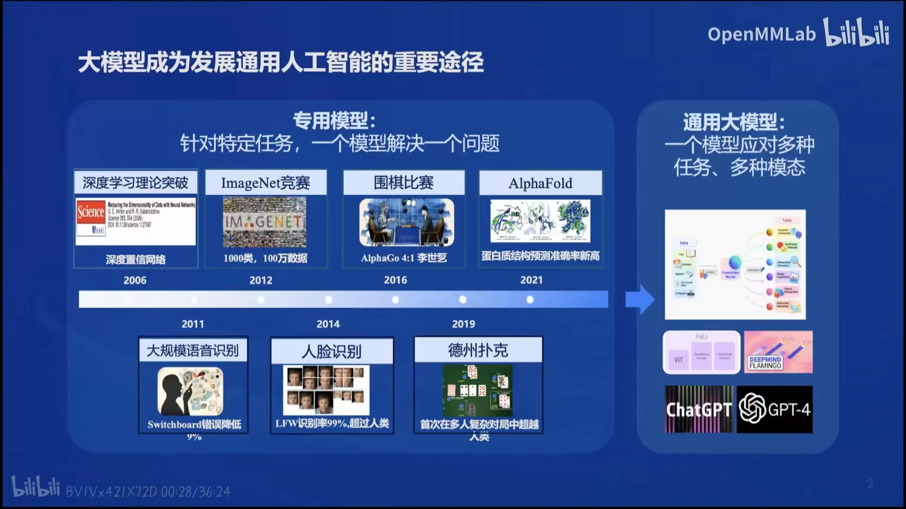
#### 书生*浦语大模型开源历程
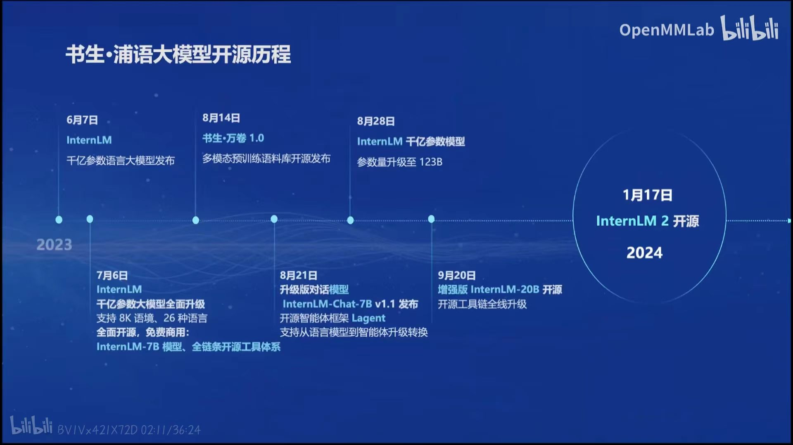

#### 书生·浦语2.0(lnternLM2)

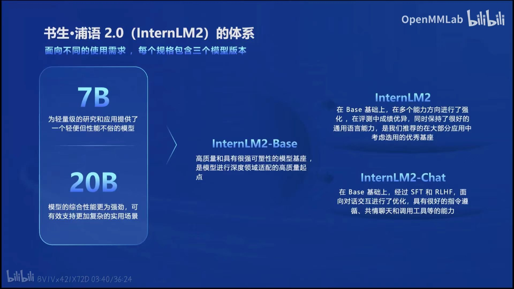

> - InternLM2-Base
> - InternLM2
> - InternLM2-Chat
#### 回归语言建模本质
  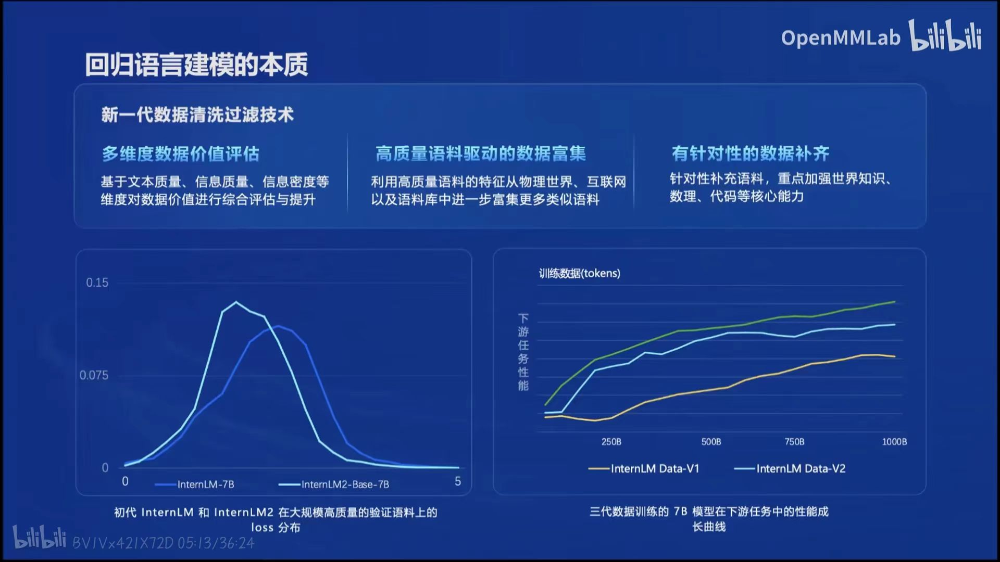

#### 书生·浦语2.0(lnternLM2)主要亮点

  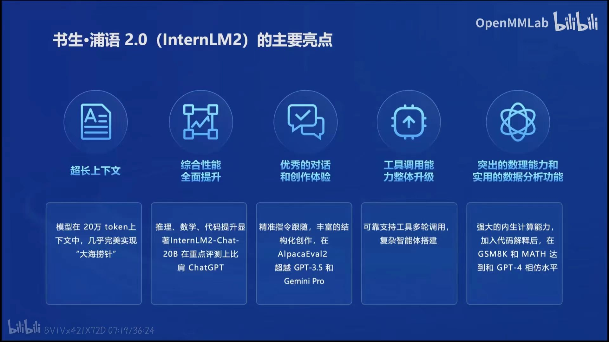

#### 创新应用
  - 充满人文关怀的对话和富有想象力的创作，且工具调用能够极大拓展大语言模型的能力边界，使得大语言模型能够通过搜索、计算、代码解释器等获取新知以解释更复杂的问题。InternLM2进一步升级了模型的工具调用能力，能够稳定进行工具筛选和多步骤规划。

#### 模型到应用典型流程

  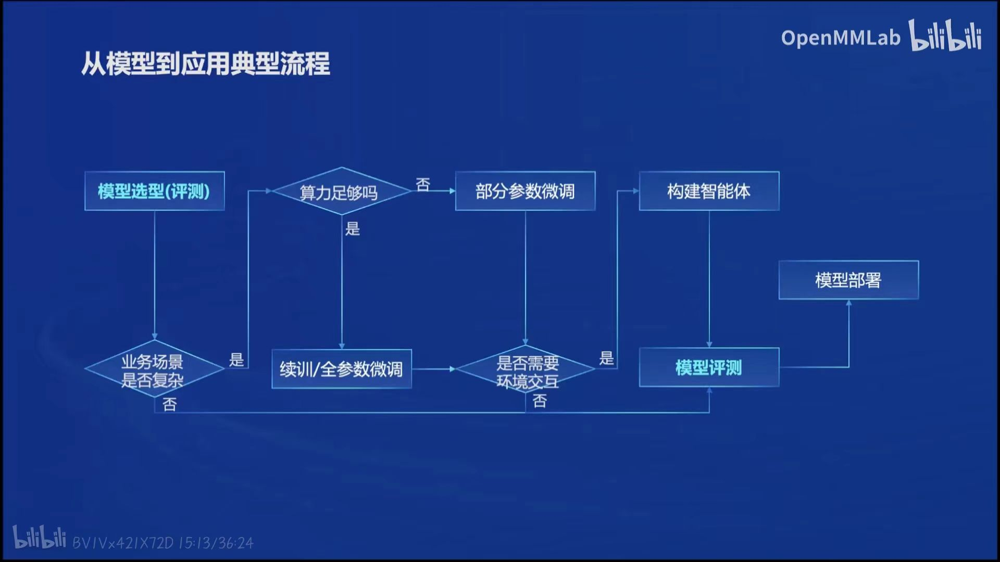

### 书生·浦语大模型开源开放体系

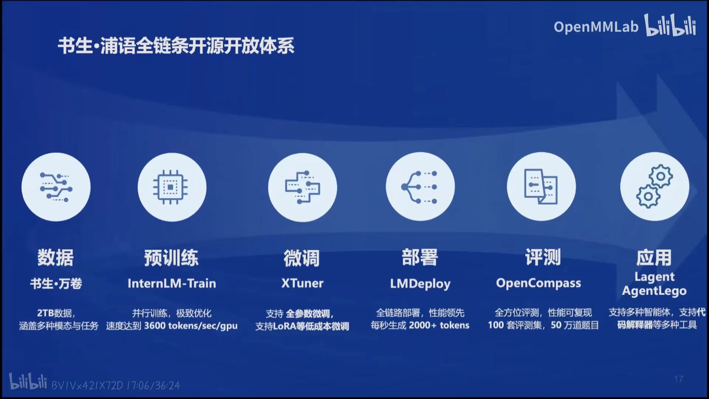

#### 开放高质量语料数据

> 获取方式：[OpenDataLab](https://opendatalab.org.cn/)

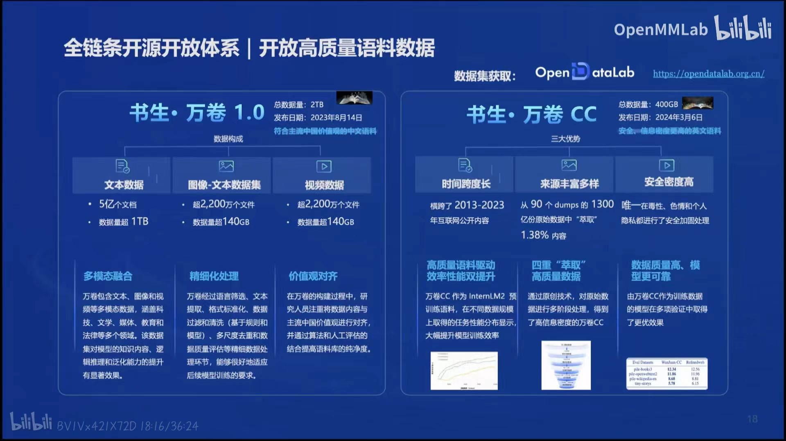

#### 预训练特征

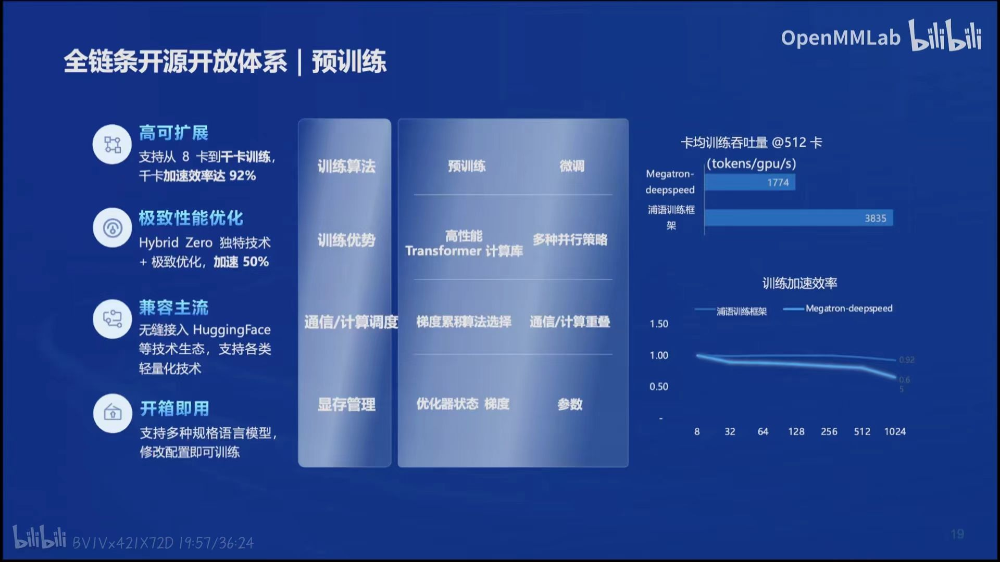

#### 模型微调
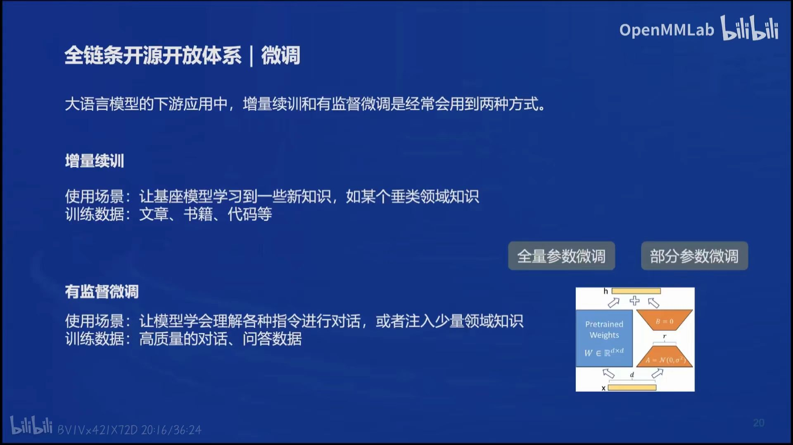
- 增量续训
  - 使用场景：让基座模型学习到一些新知识，如某个垂类领域知识
  - 训练数据：文章、书籍、代码等
- 有监督微调
  - 使用场景：让模型学会理解各种指令进行对话，或者注入少量领域知识
  - 训练数据：高质量的对话、问答数据
  - ![]a3aee6015116050bb66d0842d90be16.jpg)

- 进行部署

#### 评测

> CompassHub:高质量评测基准社区开源开放，共建共享的大模型评测基准社区

**OpenCompass2.0司南大模型评测体系正式发布**

- 整体能力仍有较大提升空间

  > 采用了更加准确的**循环评测策略**，我们实现了对模型真实能力分析。在百分制的客观评测基准中，GPT-4-Turbo也仅仅达到了61.8分的及格水平。

- 复杂推理仍是短板

  >  国内多个模型综合能力和GPT-4-Turbo在接近，但在复杂推理上仍然存在较大差距，并且和模型尺寸存在较强相关性。

- “理科”能力和模型尺寸关联性高

  > 在语言和知识这类“文科”维度，中轻量级模型和重量级/闭源商业模型差距较小，但数学、推理、代码等维度上，性能和尺寸呈现较强相关性

- 模型主客观性能需综合参考

  > 大量开源模型和API模型的客观性能和主观性能存在较大的偏差，社区不仅仅需要夯实客观能力基础，更需要在偏好对齐和对话体验上下功夫。
  

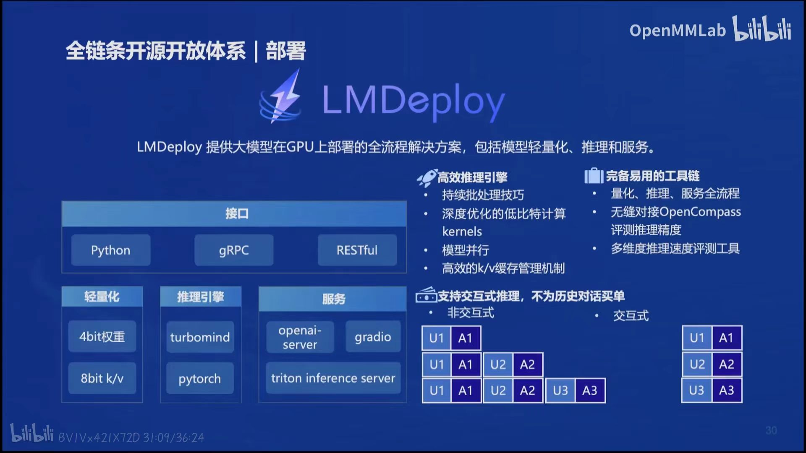
#### 应用

- 轻量级智能体框架Lagent

  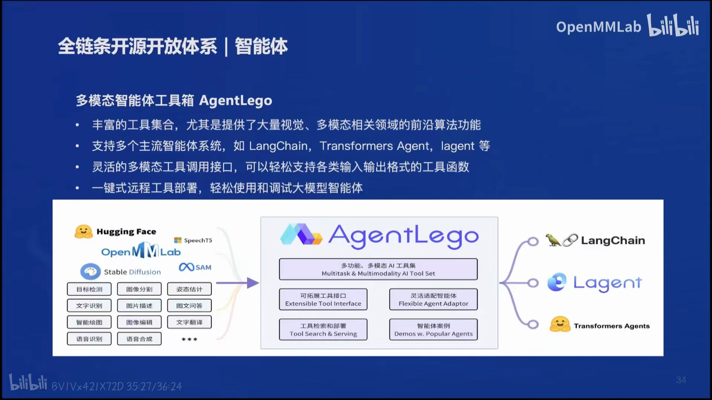

- AgentLego工具箱

  
